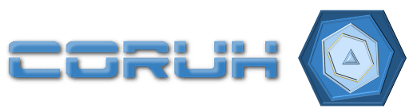

### About Us

Coruh R&D and Technology services are based on trust and quality, Our team focus on end-to-end problem solving. We are working on Fintech, Telco, IoT, Cyber Security, V2X and Medical domains also related certifications for more than 13 years. Coruh R&D and Tecnology located on Dijitalpark Teknokent Rize offices. Dijitalpark Teknokent offices are placed on both Rize and Istanbul with cooperation between Recep Tayyip Erdogan University and Turk-Alman University.

---

### Services

#### Software Development, Testing and Certification

According customer requirements in our domains, we can develop software/firmware solutions and if certification required we can handle tests

#### Academic Research

We can help you as a researcher in your projects as an academic partner

#### Project and Product Management with Documentation

We can prepare project plans and product roadmaps for you, also we can manage and monitor process and provide required documentations

#### Project Consultancy

with consultancy aggrement we can help your business according to our domain requirements or your project roadmap.

---

